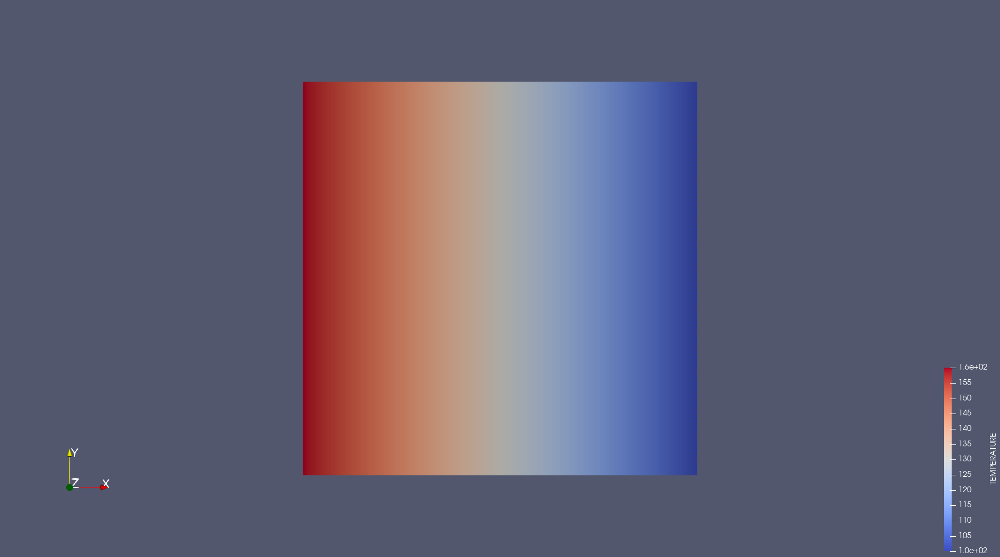

# HEAT FLOW 2D

## Description

Material parameters:
 - ISOTROPIC
 - Conductivity = 5

Boundary condition settings:
 - GREEN: heat flow = 300
 - RED: fixed temperature = 100


# Run

```
mpirun -n 4 espreso
```

## Solution

